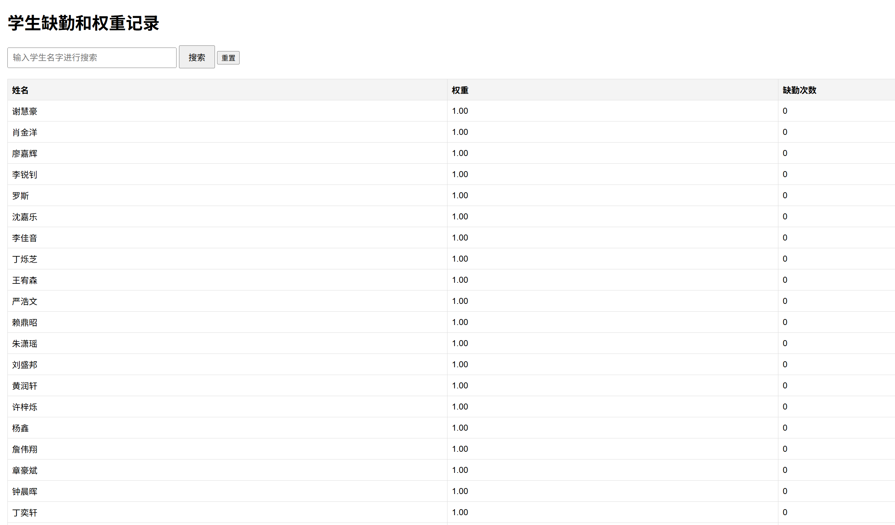

# SE-assignment.html

# 项目展示



# 启动项目
在项目目录下运行
```bash
python app.py
```
在浏览器打开 http://127.0.0.1:8000 即可看到页面

# 增加功能
+ 前后端分离，学生数据保存到csv文件中，可以从本地加载和保存到本地，使用 python 的 flask 框架发布服务
+ 点击点名按钮后，浏览器会弹出一个选择学生是否出勤的弹窗
+ 根据学生是否出勤动态调整权重，缺勤则权重增加，出勤则权重降低（但不会低于0.1，避免出现无法选中）
+ 随机查看学生权重和缺勤记录，且提供搜索功能
+ 美化界面，增加背景图